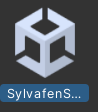

<!--more-->

# This is an avatar-agnostic setup guide for getting started with any of my bases.

### 1. Install the VRChat Creator Companion
Follow along with the official VRChat Creator Companion tutorial video.


### 2. Make a new Unity project using VRChat's Creator Companion
Refer to the above video.

### 3. Add the required packages to your project
> [!TIP]
> You can add these to your Creator Companion client packages using their respective VPM links, allowing you to one-click install and update them for all your current and future projects.

You will need the following packages in order to use and upload your avatar:

- VRChat Avatars SDK (Built-In)
- [VRCFury](https://vrcfury.com/download/) | [VPM](vcc://vpm/addRepo?url=https%3A%2F%2Fvcc.vrcfury.com)
- [Poiyomi Shader](https://github.com/poiyomi/PoiyomiToonShader) | [VPM](vcc://vpm/addRepo?url=https%3A%2F%2Fpoiyomi.github.io/vpm/index.json)

> [!WARNING]
> VRCFury is not optional! It's core to my avatar's functionality and modularity. Things will not work without it.

### 4. Open your newly created Unity Project
Be patient, loading a fresh project may take awhile.

### 5. Unzip the avatar files into a new folder and drag the .unitypackage file into your Unity
This will extract all of the avatar files into your Project tab.

### 6. Open the provided Unity scene
This will have the Optimized PC prefab by default.

### 7. Open the VRChat SDK in Unity, log in, and then upload
That's it! If you did everything correctly, you should have a usable default base uploaded to your account and ready to go.