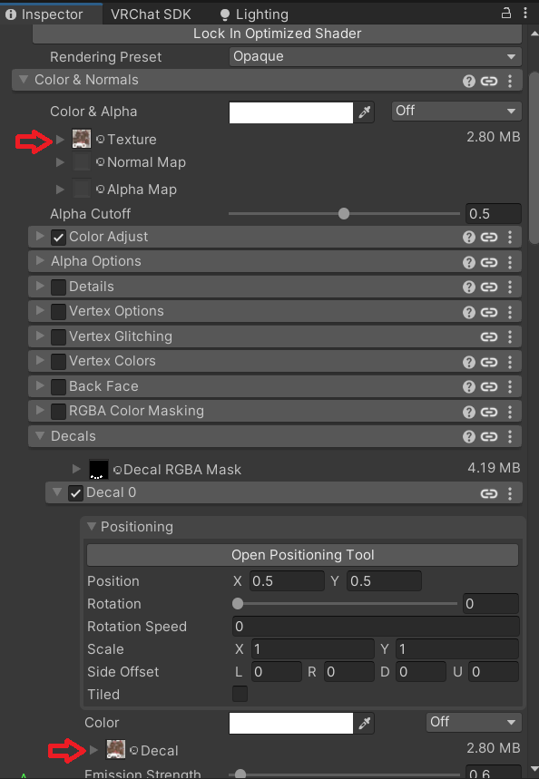

<!--more-->

# Key information for using your Sylvafen

## VRCFury, Toggles, and Parameter Bits
This Avatar is constructed to be fully modular! Don't want it? Just delete it!

Objects that are safe to delete have the number of parameter bits they used listed next to their name. Much if this functionality can be done through editing the Body's blendshapes manually and is unnecessary if you don't need to modify these while in-game.

Parameter space is very limited in VRChat and given such, this project makes heavy use of VRCFury for implementation of much of the avatar's customization functionality. Most things can be added or deleted just by deleting the associated game objects in the Avatar's hierarchy (Including GoGo Loco).

This makes it easy to make more parameter space for things you want to add!

## Prefab Variants
This avatar uses a prefab for the PC version with the Quest version being a Prefab Variant of Sylvafen_PC. If you make edits to the Prefab directly, you can have all of your PC changes happen automatically on Quest as well. This isn't required and you're more then welcome to simply edit the one in the scene directly but editing the Sylvafen_PC prefab directly can save you a lot of time with managing avatar versions for other platforms. Future DLCs may make use of additional variants which makes them even more useful.

## Eye and Face Tracking
The face-tracking prefabs rely on ADJerry91's face tracking template alongside some custom logic for emoting the ears, tail, and tongue.
To add face-tracking to your Sylvafen, simply drag the Face Tracking component from the `Components` folder onto your avatar.

## Textures
If you make your own custom textures, I would recommend copying the texture settings of the existing textures (or overwriting the originals). There's various settings in there meant to fix rendering artifacts in-game (like around the eyes, for example) and to optimize the Quest textures for upload (very important with the limited upload size of 10mb).

> [!Note]
> If you are having issues with your custom eye color not applying correctly, you need to make sure you change the emission texture as well in your `Bits` material. This is exported from the Substance file alongside your normal textures as of version `1.4.0`.
>
>Users who are using the Poiyomi will instead need to replace their existing `Decals` texture in the `Bits` material with their bits texture in addition to the normal Albedo/Base Color texture slot. Additionally, they will need to replace their `Shader Toggles (Standard Toon)` object in their avatar hierarchy with `Shader Toggles (Poiyomi)` found inside the `Components` folder.
>
>Users upgrading from `1.3.x` simply copy over their old Poiyomi materials and change their Shader Toggles as above if they prefer.

## PC/Quest Interoperability
The PC and Quest versions are nearly identical in function other than some physbones being disabled.

## Av3 Emulator and Gesture Manager

Av3 Emulator and Gesture Manager are two very popular packages for debugging and playtesting avatar features in the Unity editor. Unfortunately, some recent updates might have issues with Sylvafen. If you have these issues, try using these specific versions:

``Gesture Manager 3.9.2`` | ``Av3Emulator 3.4.6``

## Technical Information for Base Editors

For advanced users!

Refer to "FBXExportSettingsUnity.png" and "FBXExportSettingsSubstance.png" in the docs folder

Unity FBX export settings. Overwrite the existing FBX in your Unity assets. Make sure not to accidentally include the Substance Painter mesh.

The exploded model for Substance is in the .blend file. Export that and the base mesh using the settings above.

## Troubleshooting
> [!QUESTION]- I see a bunch of scripts errors and scripts that say 'None (Mono Script)'
>This happens if you don't have VRCFury added in your Unity Project. Also make sure you're using the most recent Avatars SDK

> [!QUESTION]- My upload size is too large for Quest
>If you're adding your own textures, make sure you copy the texture settings (specifically the overrides for Android) from the existing textures to make them smaller and compress more to fit the strict avatar size limit that the Quest has.

> [!QUESTION]- My custom body texture seems to be lower quality than the originals
>In your custom texture's settings, make sure your Max Size is set to 4096 (i.e. 4k) (PC Only, keep your Android Max Size at 2k or lower). Be default, Unity sets the max to 2048.

> [!QUESTION]- My unpacked avatar size seems unusually large
>This is a symptom of all the texture options on the avatar. If you are happy with just one of the texture options, just deleting the 'Texture Swap' customization objects from your Sylvafen.

> [!QUESTION]- I'd like to hide my hair and use my own
>The easiest way to accomplish this would be to shrink the HairRoot bone and then move it inside the head. Then attach your own preferred hair mesh.

> [!QUESTION]- My eye texture isn't working
>There's two slots you need to replace the 'Bits' texture in the Bits Material. One is the main texture and then there's another slot under the decals.
>
>

> [!QUESTION]- My face tracking prefab is missing components or isn't uploading
>Make sure you have AdJerry91's face tracking template installed. See the above 'Eye and Face Tracking' section.

> [!QUESTION]- My eyes won't change color, even with my custom texture applied.
>See the Textures section above.