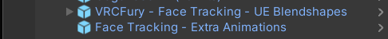

<!--more-->

# Key information for using your Sylvafen

## VRCFury, Toggles, and Parameter Bits
This Avatar is constructed to be fully modular! Don't want it? Just delete it!

Objects that are safe to delete have the number of parameter bits they used listed next to their name. Much if this functionality can be done through editing the Body's blendshapes manually and is unnecessary if you don't need to modify these while in-game.

Parameter space is very limited in VRChat and given such, this project makes heavy use of VRCFury for implementation of much of the avatar's customization functionality. Most things can be added or deleted just by deleting the associated game objects in the Avatar's hierarchy (Including GoGo Loco).

This makes it easy to make more parameter space for things you want to add!

## Prefab Variants

This avatar uses a prefab for the PC version with the Quest version being a Prefab Variant of Sylvafen_PC_Base.

This means that if you edit the prefab directly (by double-clicking it) instead of editing the scene, you can have your avatar edits effect your Quest version and all other versions as well. Highly recommend using this workflow if you intend on extensively modifying your Fen while wanting to keep the avatar cross-platform but it's not a requirement

- The 'Base' prefabs propagate their changes to all the other versions below
- The 'Public' prefabs are mostly identical save for the inclusion of the advertisement and additional color sliders/texture toggles found in the public one.
- The 'Standard' prefabs are the default without color/texture swaps for better VRAM usage.
- The 'Face-Tracking' prefabs are face-tracked, being integrated with ADJerry's FT template and utilizing the 'Parameter Compressor' component from VRCFury to fit all the face-tracking parameters alongside the standard Sylvafen offerings.

So understanding this, your ideal workflow will involve editing the 'Base' prefab and then uploading either the 'Base', 'Standard' or 'Face-Tracking' prefabs depending on what you need.

## Eye and Face Tracking
The face-tracking prefabs rely on ADJerry91's face tracking template. Add it to your project via VRChat's Creator Companion by using this URL and adding the repository and subsequently adding it to your project
> [!TIP]
> You can add this package to your Creator Companion client packages using the respective VPM links, allowing you to one-click install and update it for all your current and future projects.

[AdJerry91's Face-Tracking Template](https://adjerry91.github.io/VRCFaceTracking-Templates/) | [VPM](vcc://vpm/addRepo?url=https%3A%2F%2FAdjerry91.github.io/VRCFaceTracking-Templates/index.json)

After you've added the template to your project, simply add one of the face-tracking prefabs to your scene and upload!

### ET/FT Technical Info
If you want to add Eye/Face tracking to an existing avatar without using the prefab, all you have to do is add these two prefabs

`VRCFury - Face Tracking - UE Blendshapes` is the Universal Expressions template from AdJerry's package. It handles the animator setup for controlling the avatar's blendshapes to make your face move

`Face Tracking - Extra Animations` is optional and contains the ear, tongue, and tail animation animation logic.

## Textures

If you make your own custom textures, I would recommend copying the texture settings of the existing textures (or overwriting the originals). There's various settings in there meant to fix rendering artifacts in-game (like around the eyes, for example) and to optimize the Quest textures for upload (very important with the limited upload size of 10mb).

## PC/Quest Interoperability

The PC and Quest versions are nearly identical in function but they have a few differences

1. The hue shift options are only work on PC. Quest users will see the non-shifted version of your texture.
2. The blushing present on certain gestures is only visible on PC
3. No toe, whisker, nose, or butt physics on quest
4. Lighting options are PC only

## Av3 Emulator and Gesture Manager

Av3 Emulator and Gesture Manager are two very popular packages for debugging and playtesting avatar features in the Unity editor. Unfortunately, some recent updates to these packages have rendered newer versions unusable for the Sylvafen. Fortunately, the (slightly) older versions still work just fine.

For this reason, I recommend the following versions for now until the issue is resolved:

``Gesture Manager 3.9.2`` | ``Av3Emulator 3.4.6``

## Technical Information for Base Editors

For advanced users!

Refer to "FBXExportSettingsUnity.png" and "FBXExportSettingsSubstance.png" in the docs folder

Unity FBX export settings. Overwrite the existing FBX in your Unity assets. Make sure not to accidentally include the Substance Painter mesh.

The exploded model for Substance is in the .blend file. Export that and the base mesh using the settings above.

## Troubleshooting
> [!QUESTION]- I see a bunch of scripts errors and scripts that say 'None (Mono Script)'
>This happens if you don't have VRCFury added in your Unity Project. Also make sure you're using the most recent Avatars SDK

> [!QUESTION]- My upload size is too large for Quest
>If you're adding your own textures, make sure you copy the texture settings (specifically the overrides for Android) from the existing textures to make them smaller and compress more to fit the strict avatar size limit that the Quest has.

> [!QUESTION]- My custom body texture seems to be lower quality than the originals
>In your custom texture's settings, make sure your Max Size is set to 4096 (i.e. 4k) (PC Only, keep your Android Max Size at 2k or lower). Be default, Unity sets the max to 2048.

> [!QUESTION]- My unpacked avatar size seems unusually large
>This is a symptom of all the texture options on the avatar. If you are happy with just one of the texture options, just deleting the 'Texture Swap (6 Bits)' and 'Clothes Texture Swaps (PC/Quest)' objects in your avatar components and setting the texture you want manually in the material before uploading will bring this size down by over half.

> [!QUESTION]- I'd like to hide my hair and use my own
>The easiest way to accomplish this would be to shrink the HairRoot bone and then move it inside the head. Then attach your own preferred hair mesh.

> [!QUESTION]- My eye texture isn't working
>There's two slots you need to replace the 'Bits' texture in the Bits Material. One is the main texture and then there's another slot under the decals.
>
>

> [!QUESTION]- My face tracking prefab is missing components or isn't uploading
>Make sure you have AdJerry91's face tracking template installed. See the above 'Eye and Face Tracking' section.